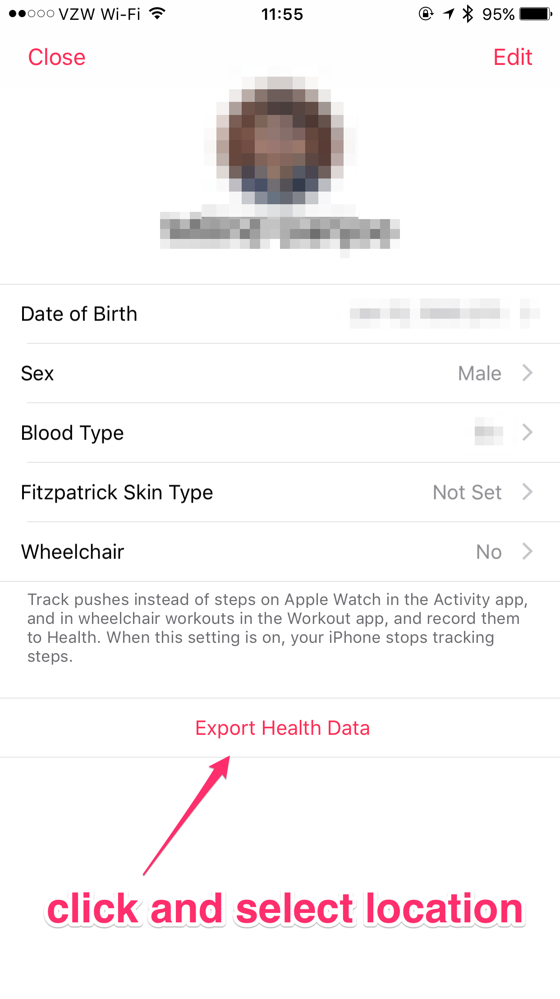

# Apple Health Data Exporter

This script takes a dump of Apple Health data (the `export.zip` file generated
through an Apple Health data export) and saves a subset of fields and records
to a [feather](https://github.com/wesm/feather) file, which can
be used by both Python and R.

## Prerequisites

* [`feather-format`](https://github.com/wesm/feather)
* [`pandas`](http://pandas.pydata.org/)
* [`lxml`](http://lxml.de/index.html)

If you have [`conda`](https://conda.io/docs/) installed, you can install
prerequisites in a new environment by doing

```bash
conda env create -f environment.yml
```

## Steps

1. Export Apple Health data from within the Health app.




2. Pick a location (usually Dropbox is convenient) and then run script:

```bash
$ python export.py /path/to/export.zip ~/Downloads/data.feather
```

3. Now you can load the data in either R or Python!
   ([instructions](https://blog.rstudio.org/2016/03/29/feather/))
